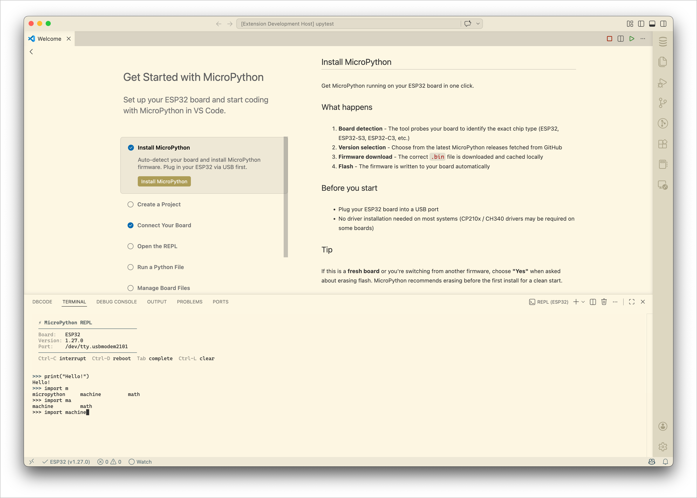
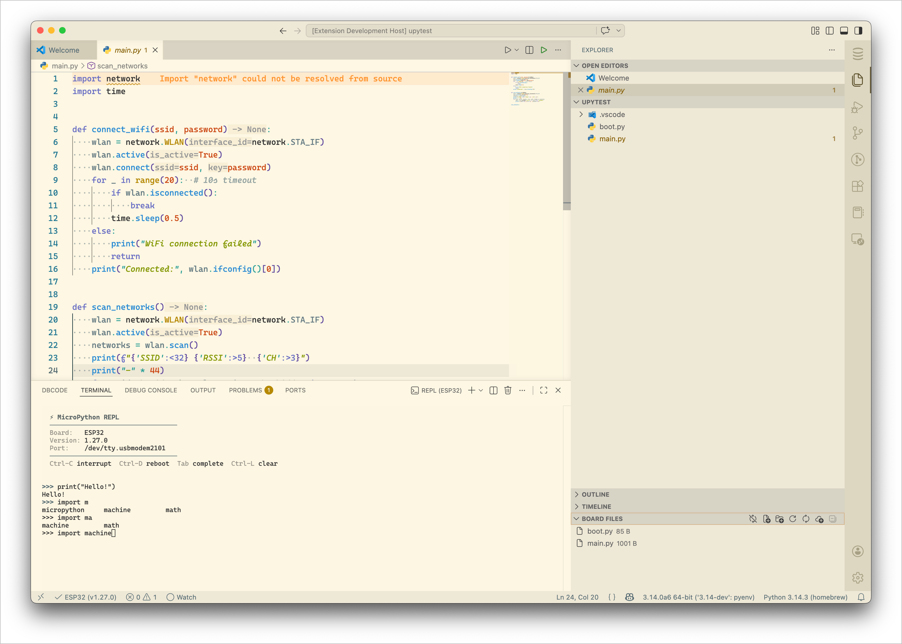
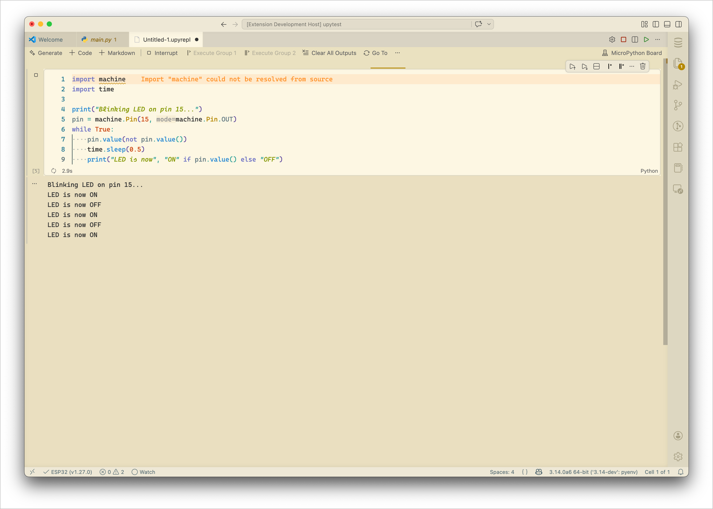

# Blinky - a MicroPython IDE

A VS Code extension that makes MicroPython development as easy as blinking an LED. Connect your board, write code, and run it - all from the editor.

## Features

### REPL Terminal
Interactive MicroPython shell with syntax-colored output, tab autocomplete, persistent history, and a rich board-info banner on connect.

### Run & Debug
Run `.py` files directly on the board with F5 or the ▶ button. Run selected code snippets. Errors are parsed into VS Code diagnostics with clickable file links.

### Board File Manager
Browse, upload, download, and delete files on the board from the sidebar. Sync your entire project in one click. Auto-sync watches for local saves and uploads automatically.

### Firmware Flashing
Detect your board, download the right MicroPython firmware, and flash - no command-line tools needed. Supports ESP32, ESP32-S2, ESP32-S3, ESP32-C3, ESP32-C6, and ESP32-H2.

### REPL Notebooks
Jupyter-style notebooks (`.upyrepl`) that run cells on the board. Mix code and documentation, re-run experiments, and keep a record of your session.

### Project Templates
Scaffold a new project from a template: Blink LED, WiFi Scanner, Web Server, or Temperature Sensor.

### Autocomplete
Install MicroPython type stubs so Pylance provides autocomplete for board modules like `machine`, `network`, and `esp32`.

## Getting Started

1. Install the extension
2. Plug in your ESP32 via USB
3. Open the Command Palette → **Blinky: Connect to Board**
4. Open the REPL or run a `.py` file

Or run **Blinky: Open Getting Started Guide** for a step-by-step walkthrough.

## Supported Boards

| Board | Flash | REPL | File Sync |
|-------|-------|------|-----------|
| ESP32 | ✅ | ✅ | ✅ |
| ESP32-S2 | ✅ | ✅ | ✅ |
| ESP32-S3 | ✅ | ✅ | ✅ |
| ESP32-C3 | ✅ | ✅ | ✅ |
| ESP32-C6 | ✅ | ✅ | ✅ |
| ESP32-H2 | ✅ | ✅ | ✅ |
| RP2040 / Pico | TODO | ✅ | ✅ |
| STM32 | TODO | ✅ | ✅ |

Any board running MicroPython with a serial REPL should work for REPL and file operations. Firmware flashing is currently ESP32-only.

## Settings

| Setting | Default | Description |
|---------|---------|-------------|
| `blinky.baudRate` | `115200` | Serial communication baud rate |
| `blinky.autoConnect` | `false` | Auto-reconnect to the last board on startup |
| `blinky.autoOpenRepl` | `true` | Open the REPL terminal after connecting |
| `blinky.syncExclude` | `[".git", "__pycache__", ...]` | Files/folders to exclude from project sync |
| `blinky.flashBaudRate` | `460800` | Baud rate for firmware flashing |
| `blinky.repl.colorizePrompt` | `true` | Color the `>>>` prompt |
| `blinky.repl.colorizeErrors` | `true` | Highlight tracebacks in red |
| `blinky.repl.richBanner` | `true` | Show board info on REPL open |
| `blinky.repl.autocomplete` | `true` | Tab autocomplete in the REPL |
| `blinky.repl.persistentHistory` | `true` | Persist command history across sessions |

## Commands

All commands are available via the Command Palette (`Ctrl+Shift+P` / `Cmd+Shift+P`) under the **blinky** category:

- **Connect to Board** / **Disconnect**
- **Open REPL Terminal**
- **Run File on Board** / **Run Selection** / **Stop Script**
- **Upload File** / **Download File** / **Sync Project**
- **Flash Firmware** / **Install MicroPython** / **Erase Flash**
- **New Project** / **New File** / **New Folder**
- **Set Up MicroPython Stubs**
- **Enable/Disable Auto-Sync**
- **Open Getting Started Guide**

## Contributing

Contributions are welcome! Please open an issue or pull request.

## License

[AGPL-3.0](LICENSE) - free and open source. If you modify and distribute Blinky, or run it as part of a service, you must share your changes under the same license.
